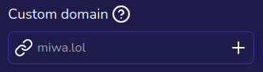

import { Plus } from 'lucide-react';
import Steps from '../../../components/mdx/Steps';
import Aside from '../../../components/mdx/Aside';

<Aside type="info">This is a Premium feature.</Aside>

Suppose you own "example.com" and want your Miwa.lol profile to show up there. When you visit "example.com", it will display your Miwa.lol profile. This page explains how to set up a custom domain for your account. No worries, it's relatively simple.

<Aside type="warning">
  Even though you can set up a custom domain, your Miwa.lol profile will still be accessible at *`https://miwa.lol/username`* (where *username* is replaced by your actual username).
</Aside>

## What you need

* A domain name (obviously, this guide won't help much without one!)  
  You can buy a domain from various registrars, such as [Namecheap](https://www.namecheap.com), [GoDaddy](https://www.godaddy.com) or [Cloudflare](https://domains.cloudflare.com/).
* Full access to your domain's DNS records

## Setting up your custom domain

First, go to your [account settings](https://miwa.lol/dashboard/settings) and click on the <Plus /> icon in the *Custom domain* field:

A dialog will appear, prompting you to enter your custom domain.

<Steps>
    1. Type in your domain name (without `https://`).

    2. Create a CNAME record pointing to `miwa.lol`.

    3. Click *Verify*.
</Steps>

<Aside type="info">
  Depending on your DNS provider, it may take a few minutes to a few hours for the changes to propagate. If you see an error message or a blank page, please wait a bit and try again.
</Aside>

## Troubleshooting

To avoid DNS problems (example: the CNAME record at the domain root), we recommend using [Cloudflare](https://www.cloudflare.com/)'s nameservers.