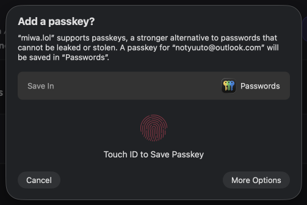
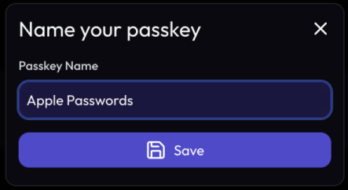

**Passkeys are a secure and fastest way to log into your account.** All passwords managers, such as *Apple Passwords*, *Bitwarden*, or even *Windows Hello*, supports this feature.

## Adding a passkey

Go to [your security settings](https://miwa.lol/dashboard/settings/security), then click on *Add* in the Passkeys section.

You will have a popup asking you to save a passkey. Depending on your password manager and OS, the UI will be different. For example, on macOS and iOS you'll probably have this:

After saving your passkey in your password manager, give it a name:

**Done, your passkey has been added!** You can now log into your Miwa.lol account using your passkey.