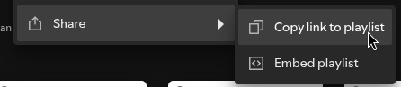
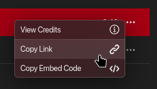
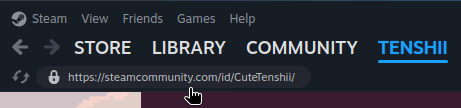

import LinkCard from '@/components/mdx/LinkCard';
import { Settings, Pickaxe, Gamepad2, AudioLines, CloudSun, Clock, AlignLeft } from 'lucide-react';
import {
  SiDiscord, SiX, SiTelegram, SiYoutube, SiTiktok, SiInstagram, SiAnilist, SiMyanimelist, SiSpotify, SiApplemusic,
  SiLastdotfm, SiOsu, SiSteam, SiRoblox, SiModrinth, SiGithub, SiJellyfin
} from '@icons-pack/react-simple-icons';

Adding a card to your profile allows you to add live content to your profile, such as showing your Discord presence
(username, what you're currently doing...), your Steam profile (username, game you're playing), and more.

To add a card on your profile, go to the *Cards* page on your dashboard, then click on the *Create* button.

You can add up to **2 cards** to your profile, or up to **6** with a [Premium account](https://miwa.lol/pricing).

## Choosing the card platform

We support a lot of services. Pick the platform you want, then provide the details described below.

### <SiDiscord color="default" /> Discord

The **presence** card shows your status and activity, just [link your Discord account](/how-to/link-your-discord/) and
it works automatically.

For a **server** card, paste an invite link to your server (e.g. `https://discord.gg/yourserver`).

### <SiX color="white" /> Twitter/X

Paste your profile URL (e.g. `https://x.com/yourusername`).

### <SiTelegram color="default" /> Telegram

Paste your channel or group link (e.g. `https://t.me/yourchannel`).

### <SiYoutube color="default" /> YouTube

Paste your channel URL (e.g. `https://youtube.com/@yourhandle`).

### <SiTiktok color="white" /> TikTok

Paste your profile URL (e.g. `https://tiktok.com/@yourusername`).

### <SiInstagram color="default" /> Instagram

Paste your profile URL (e.g. `https://instagram.com/yourusername`).

### <SiAnilist color="default" /> AniList

Paste your profile URL (e.g. `https://anilist.co/user/yourusername`).

### <SiMyanimelist color="default" /> MyAnimeList

Paste your profile URL (e.g. `https://myanimelist.net/profile/yourusername`).

### <AudioLines /> Audio player

The audio player enhances the listening experience of your audios for your visitors. It displays the song name and
includes intuitive controls to play, pause, and switch between tracks when multiple audios are available.

### <SiSpotify color="default" /> Spotify

Paste the **share link** of the track, album, artist, or playlist you want to embed.

### <SiApplemusic color="default" /> Apple Music

Paste the **share link** of the album, artist, or playlist you want to embed.

### <SiLastdotfm color="default" /> Last.fm

Paste your profile URL (e.g. `https://www.last.fm/user/yourusername`).

### <SiOsu color="default" /> osu!

Paste your profile URL (e.g. `https://osu.ppy.sh/users/yourusername`).

### <Pickaxe /> Minecraft

Enter your Minecraft username.

### <SiSteam color="white" /> Steam

Paste your profile URL (e.g. `https://steamcommunity.com/id/yourname`).

### <Gamepad2 /> Genshin Impact

Enter your **UID**, shown in the bottom-right corner of the screen while you're in-game (a 9-digit number).

### <Gamepad2 /> Honkai: Star Rail

Enter your **UID**. Like Genshin Impact, it's shown in the bottom-right corner of the screen while you're in-game.

### <SiRoblox color="white" /> Roblox

Paste your profile URL (e.g. `https://roblox.com/users/123456/profile`).

### <SiModrinth color="default" /> Modrinth

Paste the URL of any Modrinth page: a mod, server, texture pack, datapack, and more
(e.g. `https://modrinth.com/mod/yourproject`).

### <SiGithub color="white" /> GitHub

For a **profile** card, paste your profile URL. For a **repository** card, paste the repository's URL.

### <SiJellyfin color="default" /> Jellyfin

Jellyfin is self-hosted, so it needs a bit more setup than the other cards:

<LinkCard
  href="/cards/creating-a-card/jellyfin/"
  title="Setting up a Jellyfin card"
  description="Create an API key and connect your self-hosted Jellyfin server."
  icon={SiJellyfin}
/>

### <CloudSun /> Weather

Set the location you want to show the weather for.

### <Clock /> Time

Set the timezone you want to display.

### <AlignLeft /> Text

Enter any custom text you'd like to show. The text supports **Markdown**, so you can add formatting like bold, italics,
links, and lists.

## Card rows <Badge text="Premium feature" />

Changing the number of rows on your card allows it to show more content than default.

For example, the AniList card shows your recent activity if you choose to show more than 2 rows.

## Customizing your card

With a Premium account, you can toggle individual elements of a card on or off to better match your style.

<LinkCard
  href="/cards/settings/"
  title="Cards Settings"
  description="Customize the look and feel of your cards by enabling or disabling certain elements."
  icon={Settings}
/>
