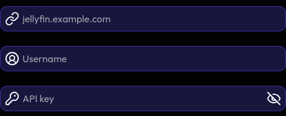

import Aside from '../../../../components/mdx/Aside';
import { Plus } from 'lucide-react';

Because Jellyfin is a service you self-host, you need a bit more of configuration to set up a Jellyfin card.

## Getting an API key

An API key is **required** to set up a Jellyfin card. Without one, Miwa.lol cannot fetch any data from your server.

<Aside type="info">
  You need to be an admin to create an API key.
</Aside>

To create an API key on your Jellyfin server:

1. Open your Jellyfin web interface and sign in with an admin account.
2. Click your profile icon in the top-right corner, then go to the *Dashboard*.
3. In the sidebar, scroll down to the *Advanced* section and click *API Keys*.
4. Click the <Plus /> button next to the *API Keys* heading.
5. Enter an app name (for example, `Miwa.lol`) so you can recognize the key later, then click *OK*.
6. Your new key will appear in the list. Copy it and paste it into the Jellyfin card settings on Miwa.lol.

<Aside type="warning">
  Treat your API key like a password. Anyone with it can access your Jellyfin server, so don't share it publicly.
</Aside>

## Creating the card

We ask for your server hostname (requires a public hostname), your Jellyfin username and your API key.

## Troubleshooting

### Miwa.lol won't connect to my server!

**Your server needs to be accessible on the public Internet.** We do not support servers behind a local network or VPNs,
because we simply cannot access them.

Please also be aware that your server needs to have a trusted SSL certificate (self-signed certificates won't work).

### I use an IP whitelist / firewall

Try whitelisting `162.19.153.188`. If we ever change the IP we use to fetch data from your server, we will update it here!
