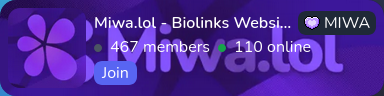
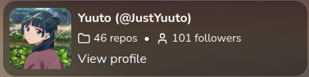

import Aside from '@/components/mdx/Aside';

**Here are some examples of cards you can create.** This is not an exhaustive list, as new card types may be added in the future.

## Discord Presence

<Aside type="tip">
  If you're listening to music on Spotify, your visitors will be able to click on the song title to listen to it on Spotify.
</Aside>

## Discord Server

## GitHub Profile

