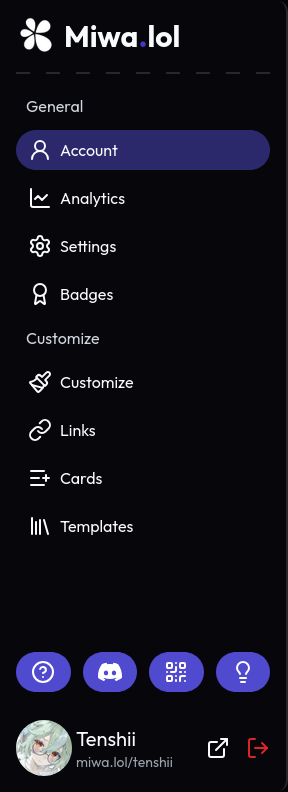

import {
  Award,
  ChartLine,
  ExternalLink,
  HelpCircle, Library,
  Lightbulb, Link, ListPlus,
  Paintbrush,
  QrCode,
  Settings,
  User2
} from 'lucide-react';
import { SiDiscord } from '@icons-pack/react-simple-icons';

The sidebar in the dashboard allows you to easily navigate through different sections to manage your profile and settings.

  

  

    Here's an overview of the sections available in the dashboard:

    * <User2 /> **Account** - View an overview of your account.
    * <ChartLine /> **Analytics** - View analytics about your profile, such as the number of views and clicks, and other statistics.
    * <Settings /> **Settings** - Update your account settings, such as your username, password, and two-factor authentication.
    * <Award /> **Badges** - View and manage the badges you have earned. [Learn more](/account/badges/)  
    * <Paintbrush /> **Customize** - The main section to customize your profile. You can change the theme, layout, colors, fonts, and other visual aspects of your profile. [Learn more](/customize/)
    * <Link /> **Links** - Manage the links to your social media profiles and other websites. [Learn more](/links/)
    * <ListPlus /> **Cards** - Manage the cards displayed on your profile. It's a great way to showcase content, such as a Discord server, your Discord presence, or other external content. [Learn more](/cards/)
    * <Library /> **Templates** - Browse and apply pre-made templates to quickly set up your profile. [Learn more](/templates/)  
    * <HelpCircle /> - This website
    * <SiDiscord /> - Redirects to [our Discord server](https://discord.gg/miwa).
    * <QrCode/> - Get a QR code to scan or share to access your Miwa.lol profile.
    * <Lightbulb/> - Gives you ways to make suggestions for Miwa.lol.  
    * Your profile, which you can access by clicking <ExternalLink /> or *miwa.lol/&lt;username&gt;*.
  

