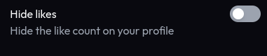

import { Heart } from 'lucide-react';
import Aside from '../../../components/mdx/Aside';
import Steps from '../../../components/mdx/Steps';

**Miwa.lol allows you to like other users' profiles.** This is a great way to show your appreciation for their page.

## How to like a profile

<Aside type="info">
  **You can only like a profile if you're logged in.** If you're not, you will be prompted to log in before you can like a profile.
</Aside>

<Steps>
  1. Go to the profile you want to like.

  2. Click the <Heart /> icon in the bottom right corner of the profile card.
     If you don't see this icon, it means the user disabled their likes.
</Steps>

## Leaderboard

The [leaderboard](/getting-started/leaderboard), by default, shows the most liked profiles. This is a great way to discover new profiles and see what others are enjoying.

<Aside type="tip">
  This is also a great way to get your profile noticed by others. **The more likes you have, the higher you will appear on the leaderboard!**
</Aside>

## Hiding likes <Badge text="Premium feature" variant="note" />

If you want to hide your profile likes from other users and the leaderboard, you can do so in **Customize > Privacy**.

