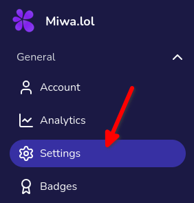
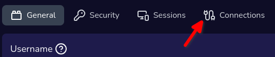
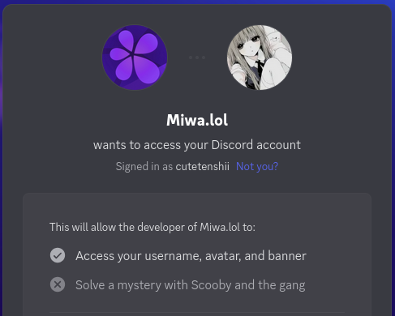

import Steps from '../../../components/mdx/Steps';

**Linking your Discord account to your Miwa.lol account allows you to use the [Discord presence](/cards/examples/#discord-presence) card, which shows your current activity on Discord.**
It's also useful to use our Discord bot.

## Linking your Discord account

<Steps>
  1. Go to your dashboard, then go to the **Settings** page.
    

  2. Go to the **Connections** tab.
    

  3. Click on the **Link** button.
    

  4. You will be redirected to the Discord authorization page. From there, authorize *Miwa.lol* to access your Discord account.
    

  5. Once authorized, you will be redirected back to the Miwa.lol dashboard. If everything went well, you should see something like this:
    
</Steps>