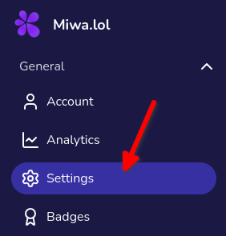
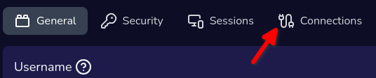
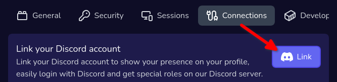
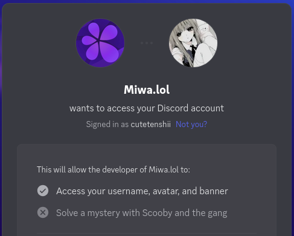
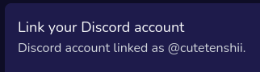

import Steps from '../../../components/mdx/Steps';
import Aside from '../../../components/mdx/Aside';
import LinkCard from '../../../components/mdx/LinkCard';
import { Component } from 'lucide-react';

**Linking your Discord account to your Miwa.lol account allows you to use the [Discord presence](/cards/examples/#discord-presence) card, which shows your current activity on Discord.**
It also lets you use your [Discord avatar](/customize/assets/#use-discord-avatar) as your profile picture, log in with Discord, use our Discord bot, and get special roles on our server.

## Linking your Discord account

<Steps>
  1. Go to your dashboard, then go to the **Settings** page.
    

  2. Go to the **Connections** tab.
    

  3. Click on the **Link** button.
    

  4. You will be redirected to the Discord authorization page. From there, authorize *Miwa.lol* to access your Discord account.
    

  5. Once authorized, you will be redirected back to the Miwa.lol dashboard. If everything went well, you should see something like this:
    
</Steps>

<Aside type="info">
  To unlink it later, come back to the same tab and click **Unlink**.
</Aside>

## Other connections

Discord isn't the only account you can connect - you can link Google and Apple too, to sign in with them.

<LinkCard
  href="/account/connections/" title="Connections" icon={Component}
  description="Manage your linked Discord, Google, and Apple accounts."
/>