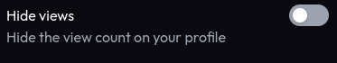

import Aside from '../../../components/mdx/Aside';

**Your profile views are a measure of how many times your profile has been viewed by other users.** This is a great way to see how popular your profile is and how many people are interested in your content.

## Finding your profile views count

**Your profile views are displayed on your profile page, in the bottom left of your profile card.**

You can also see your profile views in the dashboard and the leaderboard, where you can compare your views with other users.

## Increasing your profile views

There are several ways to increase your profile views:
- Share your profile link on social media and other platforms. We have a channel dedicated to sharing profiles on our [Discord server](https://discord.gg/miwa).
- Engage with the Miwa.lol community.
- Create high-quality content that attracts users to your profile.
- Participate in challenges and events to gain visibility.

<Aside type="danger" title="Important">
  Obviously, we **do not** allow using bots or other artificial means to increase your profile views.
  This can result either in the fraudulent views being removed or your account being banned. 
  **We want to ensure that the leaderboard is a fair and accurate representation of the Miwa.lol community.**
</Aside>

## Hiding your profile views  <Badge text="Premium feature" variant="note" />

If you want to hide your profile views from other users, you can do so in **Customize > Privacy**. This will hide your profile views from other users, but you will still be able to see your own profile views.

