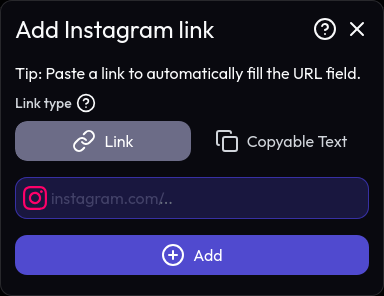

import Aside from '@/components/mdx/Aside';
import { PlusCircle } from 'lucide-react';

**To add links to your profile, go to the [Links](https://miwa.lol/dashboard/links) page of the dashboard.**
Select the social media platform you want to add a link for, and enter your username or profile URL.

Then, click the <PlusCircle /> **Add** button to add the link to your profile. You can add multiple links by repeating this process.

<Aside type="tip">
  You don't have to work out which part of a URL to enter: paste the whole profile link and we'll fill the field in for you.
</Aside>

## Link types

Here are the types of links you can add to your profile:
* **Link**: The link will be displayed as a clickable link, opening in a new tab.
* **Copyable Text**: Clicking will copy the entered text to the visitor's clipboard, without opening anything.

<Aside type="info">
  Some platforms, such as crypto addresses and friend codes, are always copyable text - there's no page to open. See the [copy-only platforms](/links/supported-platforms/#copy-only-platforms).
</Aside>
