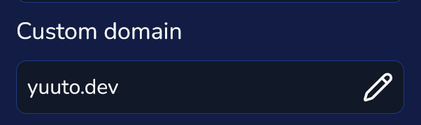

# Custom Domain

:::note

This feature requires you to be a Premium user.

:::

Imagine you own the domain "example.com". Maybe you'd like your Miwa.lol profile to appear directly on that domain (so that when you go to "example.com", it shows your Miwa.lol profile).

This section explains how to set up a custom domain for your account. No worries—it's relatively simple.

## What You Need

To make this work, you’ll need:

* A domain name (obviously, this guide won't help much without one!)
* Full access to your domain’s DNS records

## Setting Up Your Custom Domain

1. First, go to your [account settings](https://miwa.lol/dashboard/settings) and click on the pencil icon in the "Custom Domain" field:

   

2. Next, create a DNS record of type **CNAME**. Set the **name** to your domain (e.g., "domain.tld" without "https://" or any additional path) and the **value** to `miwa.lol`.

3. Once that’s done, click the "Next" button.

4. We’ll then prompt you to create a **TXT record**. Set the **name** to `_cf-custom-hostname.domain.tld` (replacing "domain.tld" with your domain) and use the provided UUID as the **value**.

5. Finally, click "Verify domain.tld" in your settings.

Once completed, visit your domain. If everything is set up correctly, your Miwa.lol profile will display!
