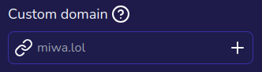

:::info

This is a Premium+ feature.

:::

Suppose you own "example.com" and want your Miwa.lol profile to show up there. When you visit "example.com", it will display your Miwa.lol profile. This page explains how to set up a custom domain for your account. No worries, it's relatively simple.

:::note

Even though you can set up a custom domain, your Miwa.lol profile will still be accessible at https://miwa.lol/username (where "username" is replaced by your actual username).

:::

## What you need

* A domain name (obviously, this guide won't help much without one!)  
  You can buy a domain from various registrars, such as [Namecheap](https://www.namecheap.com) or [GoDaddy](https://www.godaddy.com).
* Full access to your domain’s DNS records

## Setting Up Your Custom Domain

First, go to your [account settings](https://miwa.lol/dashboard/settings) and click on the plus icon in the "Custom domain" field:

Then, follow the instructions to set up your custom domain.

Once completed, visit your domain. If everything is set up correctly, your Miwa.lol profile will display!

:::note

It may take a few minutes for the changes to propagate.

:::