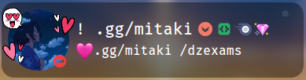

# Discord Presence

:::info

You need to link your Discord account to your profile to use this feature.

:::

This card allows you to display your Discord presence on your profile. It will show your username, avatar, avatar decoration (if you have one), badges, your status and what you're playing.

An example of how it will look like:

