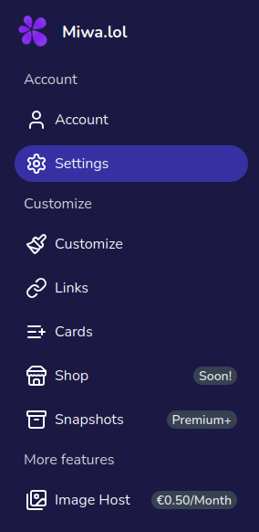

Once your account is created, and you've completed the onboarding process, you can set up your profile by visiting your [dashboard](https://miwa.lol/dashboard)!

## Navigating the dashboard

The sidebar in the dashboard allows you to easily navigate through different sections to manage your profile and settings.

  

Here’s an overview of the sections available in the dashboard:

* **Account**: View an overview and stats of your account.
* **Settings**: Update your account settings, such as your username, password, and two-factor authentication.
* **Customize**: Personalize your profile. We explain every option in the [Customization](/category/customization) section.
* **Links**: Manage the links to your social media profiles and other websites. [Learn more...](/links/)
* **Cards**: Manage the cards displayed on your profile. It's a great way to showcase content, such as a Discord server, your Discord presence, or other external content. [Learn more...](/cards/)
* **Shop**: This option will come soon.
* **Snapshots**: View and manage your snapshots. Snapshots are a way to save the current state of your profile, including your customization settings and cards. You can create a snapshot to save your current profile setup, and you can restore it later if needed.
* **Image Host**: Upload images to our image host and share them via a link.
