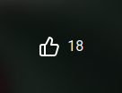
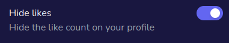

Miwa.lol allows you to like other users' profiles. This is a great way to show your appreciation for their page.

## How to like a profile

:::info

You can only like a profile if you're logged in. If you're not, you will be prompted to log in before you can like a profile.

:::

1. Go to the profile you want to like.
2. Click the thumbs up icon in the bottom right corner of the page. 
   

## Leaderboard

The [leaderboard](/getting-started/leaderboard), by default, shows the most liked profiles. This is a great way to discover new profiles and see what others are enjoying.

:::tip

This is also a great way to get your profile noticed by others. **The more likes you have, the higher you will appear on the leaderboard!**

:::

## Hiding likes

:::info

This is a Premium feature.

:::

If you want to hide your profile likes from other users, you can do so in **Customize > Privacy**.

