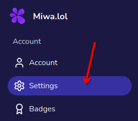
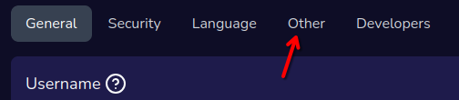
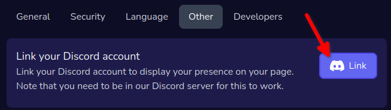

Linking your Discord account to your Miwa account allows you to use the [Discord presence](/cards#discord-presence) card, which shows your current activity on Discord.
It's also useful to use our Discord bot.

To link your Discord account, follow these steps:
- Go to your dashboard, then go to the **Settings** page.

  
- Go to the **Other** tab.

  
- Click on the **Link** button.

  
- You will be redirected to the Discord authorization page. From there, authorize *Miwa.lol* to access your Discord account.
- Once authorized, you will be redirected back to the Miwa dashboard. If everything went well, you should see something like this:

  
