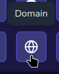

By adding links to your profile, you can make your profile more interactive and allow visitors to easily access your other social media accounts, websites, or any other links you want to share.

## Adding Links

To add links to your profile, go to the "**[Links](https://miwa.lol/dashboard/links)**" page in the left sidebar of your dashboard.
Select the social media platform you want to add a link for, and enter your username or profile URL.

You can also add a custom link by selecting the "Domain" option (it can be any link, such as a website or a specific page) - see the [Adding a Custom Link](#adding-a-custom-link) section below for more details.

## Reordering Links

To reorder your links, simply drag and drop them in the desired order. The order you set here will be reflected on your profile.

## Removing Links

To remove a link, click the trash can icon next to the link you want to delete.

## Adding a Custom Link

:::tip

You can even add a custom icon for your custom link! To do this, click the "Upload" button next to the icon field.
In case you don't upload an icon, the website's favicon will be used as the icon.

:::

To add a custom link, select the "Domain" option in the list.

Then, enter the link you want to add and click "Add". This can be any link, such as a website or a specific page.

## Supported Platforms

We support a wide range of platforms, here's the full list:

* X/Twitter
* Instagram
* YouTube
* Discord
* BlueSky
* Snapchat
* Reddit
* TikTok
* Twitch
* Kick
* Facebook
* LinkedIn
* Telegram
* Mastodon
* Threads
* GitHub
* GitLab
* Steam
* Battle.net
* NameMC
* Roblox
* osu!
* Valorant
* League of Legends
* Counter-Strike 2
* Spotify
* SoundCloud
* Deezer
* PayPal
* Bitcoin
* Ethereum
* Litecoin
* Monero
* BuyMeACoffee
* Ko-Fi
* CashApp
* Pinterest
* OnlyFans
* Custom Domain (see [Adding a Custom Link](#adding-a-custom-link))
* Email
* Fiverr
* Kickstarter
* Pixiv
* MyAnimeList
* Last.fm
* Genius