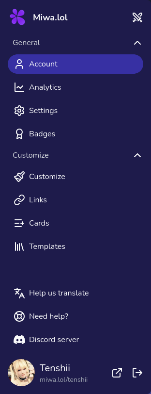

The sidebar in the dashboard allows you to easily navigate through different sections to manage your profile and settings.

  

Here's an overview of the sections available in the dashboard:

* **Account**: View an overview of your account.
* **Analytics**: View analytics about your profile, such as the number of views and clicks, and other statistics.
* **Badges**: View and manage the badges you have earned. [Learn more](/account/badges/)
* **Settings**: Update your account settings, such as your username, password, and two-factor authentication.
* **Customize**: The main section to customize your profile. You can change the theme, layout, colors, fonts, and other visual aspects of your profile. [Learn more](/customize/)
* **Links**: Manage the links to your social media profiles and other websites. [Learn more](/links/)
* **Cards**: Manage the cards displayed on your profile. It's a great way to showcase content, such as a Discord server, your Discord presence, or other external content. [Learn more](/cards/)
* **Templates**: Browse and apply pre-made templates to quickly set up your profile. [Learn more](/templates/)
   